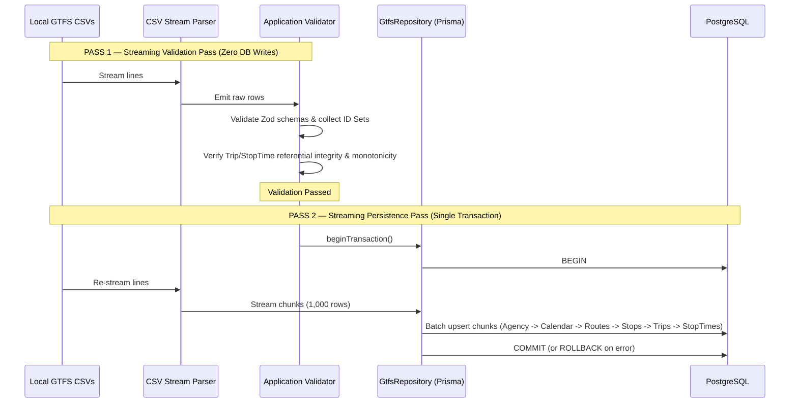

# Design: 02-gtfs-importer

## Context & Problem Statement
To enable realistic route exploration and active recall training for Queensland bus drivers, the application must ingest official GTFS schedule data from Translink Queensland. 

GTFS feeds consist of multiple interrelated CSV files. The ingestion pipeline must:
1. Accurately parse RFC-4180 CSV files without fragile string splitting or unsolicited field mutation (e.g. premature trimming).
2. Execute a **Two-Pass Streaming Model** that performs 100% pre-validation of syntax, schemas, and cross-file references without loading full datasets into RAM.
3. Guarantee **Transaction Atomicity (Option A)** so that any mid-import failure triggers a complete rollback with zero partial data retained.
4. Enforce **Strict Idempotency** (identical feeds succeed as no-ops, conflicting feeds fail explicitly).
5. Maintain clean architectural boundaries decoupling domain and application use cases from database drivers.

---

## 1. System Architecture & Boundaries

### Runtime Processing Flow (Two-Pass Streaming Model)
```text
GTFS Directory (CSV files on disk)
  │
  ├───► PASS 1: Streaming Validation Pass (Zero DB Mutations)
  │     ├── Infrastructure: CSV Stream Parser (raw strings, RFC-4180 compliant)
  │     ├── Infrastructure: GTFS Field Normalizers & Row Validators (Zod schemas)
  │     ├── Application: Cross-File Referential Validator
  │     │     ├── Collects lightweight ID Sets (route_ids, stop_ids, trip_ids, service_ids)
  │     │     ├── Verifies Trip -> Route & Trip -> Service ID Union
  │     │     ├── Verifies StopTime -> Trip & StopTime -> Stop
  │     │     └── Verifies StopTime sequence monotonicity (strictly increasing per trip)
  │     └── Result: Validation Report (PASS -> proceed to Pass 2; FAIL -> abort immediately)
  │
  └───► PASS 2: Streaming Persistence Pass (Single Atomic Transaction)
        ├── Infrastructure: Re-read local CSV files from disk via stream parser
        ├── Application: ImportGtfsUseCase opens transaction via GtfsRepository port
        ├── Infrastructure: PrismaGtfsRepository executes chunked batch upserts
        ├── Strict Idempotency Check: identical payload allowed, conflicting payload rejected
        └── Result: COMMIT on success (zero partial import) or ROLLBACK on abort
```

### Compile-Time Dependency Rules
```text
   ┌────────────────────────────────────────────────────────┐
   │                      Domain Layer                      │
   │  - Pure TypeScript domain models                       │
   │  - Value Objects (GtfsTime) & Aggregates (StopSequence)│
   │  - ZERO dependencies on Application or Infrastructure  │
   └───────────────────────────▲────────────────────────────┘
                               │ depends on
   ┌───────────────────────────┴────────────────────────────┐
   │                   Application Layer                    │
   │  - Ingestion Use Cases (import-gtfs-use-case.ts)       │
   │  - Cross-File Validation Service                       │
   │  - Port Definition: GtfsRepository interface           │
   │  - ZERO dependencies on PrismaClient or Node fs        │
   └───────────────────────────▲────────────────────────────┘
                               │ implements / depends on
   ┌───────────────────────────┴────────────────────────────┐
   │                  Infrastructure Layer                  │
   │  - CSV Stream Parser (csv-stream-parser.ts)            │
   │  - Row Schemas & Normalizers (gtfs-row-schemas.ts)     │
   │  - Repository Adapter: PrismaGtfsRepository            │
   │  - Prisma Client & Node filesystem access              │
   └────────────────────────────────────────────────────────┘
```

---

## 2. Transaction Atomicity Strategy: Option A (Single Transaction)

### Strategy Evaluation
- **Option A (Single Interactive Transaction, SELECTED FOR V1)**:
  - *Mechanism*: Pass 1 guarantees 100% data and referential validity before database mutation begins. Pass 2 executes within a single interactive transaction `prisma.$transaction(async (tx) => { ... }, { timeout: 120000, maxWait: 10000 })` using chunked batch writes (`createMany`).
  - *Guarantee*: If any failure occurs (e.g. connection dropped at row 500,001 of `stop_times`), PostgreSQL rolls back the entire transaction. **Zero partial import is retained.**
  - *Complexity*: Clean and minimal; requires no auxiliary staging tables or schema modifications.
- **Option B (Staging Tables / Atomic Publish, Architectural Reference for Large Scale)**:
  - *Mechanism*: Ingest into temporary staging tables (`staging_gtfs_*`), validate, and swap into production tables via partition swap or table renaming.
  - *Trade-off*: Excellent for massive multi-million row datasets, but introduces significant schema complexity and migration overhead for V1.
- **Option C (Batch Atomicity Only, REJECTED)**:
  - *Trade-off*: Leaves half-imported routes/trips without stop times on failure, corrupting the training application state. Rejected as unacceptable.

**V1 Decision**: **Option A** is formally adopted. Combined with Pass 1 streaming pre-validation, it delivers 100% atomic imports with zero partial data risk.

---

## 3. Two-Pass Streaming Execution Model

To reconcile **complete pre-validation** with **low memory consumption**, the pipeline operates in two streaming passes over local disk files:



### Memory Footprint Guarantee
- Full row objects are **NEVER** stored in memory arrays (`no parseAll()`).
- Pass 1 accumulates only lightweight string identifier sets:
  ```typescript
  const validRouteIds = new Set<string>();
  const validStopIds = new Set<string>();
  const validTripIds = new Set<string>();
  const calendarServiceIds = new Set<string>();
  const calendarDateServiceIds = new Set<string>();
  ```
- For 50,000 trips and stops, these string sets consume <10 MB of RAM, compared to hundreds of MBs if storing full row objects.
- In Pass 1, stop sequence monotonicity is validated on the fly using a streaming tracker: `Map<string, number>` tracking the `lastStopSequence` for each active trip ID.

---

## 4. Application-Level Referential Integrity & Service ID Universe

Because GTFS allows `calendar_dates.txt` alone to define service schedules (Case B), database-level foreign keys from `GtfsTrip` to `GtfsCalendar` and `GtfsCalendarDate` to `GtfsCalendar` are decoupled. Integrity is strictly enforced by the Application Validator:

### Service ID Universe
```text
ValidServiceIds = Set(calendar.service_id) ∪ Set(calendar_dates.service_id)
```
- **Case A (`calendar` + `calendar_dates`)**: `ValidServiceIds` is the union of regular and exception service identifiers.
- **Case B (`calendar_dates` only)**: `calendar.txt` is absent; `ValidServiceIds` is derived entirely from `calendar_dates.service_id`.
- **Validation Rule**:
  ```typescript
  if (!validServiceIds.has(trip.serviceId)) {
    throw new ReferentialIntegrityError(
      `Trip "${trip.id}" references unknown serviceId "${trip.serviceId}"`
    );
  }
  ```

### Cross-File Reference Rules
1. `trip.routeId ∈ validRouteIds` (must exist in `routes.txt`).
2. `trip.serviceId ∈ ValidServiceIds` (must exist in `calendar.txt` or `calendar_dates.txt`).
3. `stopTime.tripId ∈ validTripIds` (must exist in `trips.txt`).
4. `stopTime.stopId ∈ validStopIds` (must exist in `stops.txt`).

---

## 5. Strict Idempotency & Conflict Rejection Contract (Mode 1)

In Mode 1, importing a feed guarantees:

### A. Identical Payload (Idempotent No-Op)
If an incoming record matches an existing record's primary/composite key AND has identical attribute values, it is treated as a clean idempotent match. No duplicate row is created, and row counters remain stable.

### B. Conflicting Payload (Rejection Failure)
If an incoming record shares a primary/composite key with an existing database record but contains **conflicting attribute values** (e.g. same `route_id` but different `route_short_name`), the importer triggers an explicit **`ImportConflictError`** and halts ingestion.
- *Rationale*: Silently ignoring changes via `skipDuplicates` masks corrupt feed updates or data divergences.

### C. Stale Records & Driver Knowledge Safety
- Mode 1 does not delete records that exist in the database but are missing from the current feed.
- Driver knowledge (`DriverNote`, `HazardAlert`) resides in decoupled tables and is **NEVER** modified or deleted by GTFS operations.
- Destructive feed purge is explicitly reserved for future Mode 2 operations.

---

## 6. Agency ID Conditional Validation

In accordance with the official GTFS Schedule specification for `agency.txt`:
1. **Explicit ID**: If `agency_id` is present in the feed, it is validated and persisted.
2. **Single-Agency Omission**: If `agency_id` is omitted AND `agency.txt` contains exactly 1 row, an internal deterministic identifier (e.g. `"DEFAULT_AGENCY"`) is assigned.
3. **Multi-Agency Omission**: If `agency_id` is omitted AND `agency.txt` contains multiple rows, validation **FAILS** immediately with `InvalidAgencyDefinitionError`.

---

## 7. Stop Times Field Categorisation & Monotonicity Rules

### Field Categorisation in `stop_times.txt`
1. **Persist Now (V1 Scope)**:
   - `trip_id`: Trip identifier (references `GtfsTrip`).
   - `stop_sequence`: Order indicator (must be non-negative integer; must strictly increase per trip).
   - `stop_id`: Stop identifier (references `GtfsStop`).
   - `arrival_time`: Service-day elapsed time string (e.g. `24:10:00`, nullable).
   - `departure_time`: Service-day elapsed time string (nullable).
   - `timepoint`: Exact timing point flag (1 = exact, 0 = approximate, defaults to 1).
2. **Parse & Validate but Defer Persistence (V2 Candidates)**:
   - Fields: `stop_headsign`, `pickup_type`, `drop_off_type`, `shape_dist_traveled`.
   - *Behavior*: Parsed by the CSV parser, validated for correct syntax and numeric ranges by Zod schemas, but intentionally omitted from the V1 Prisma persistence model. The `ImportSummary` diagnostic report logs their presence and row count.
3. **Unsupported / Rejected**:
   - Realtime extensions and frequency-based continuous stop times.

### Monotonicity Validation
- The GTFS specification requires `stop_sequence` to increase along a trip, but does not require consecutive values.
- **Valid**: `T1: [1, 23, 40]` -> PASS.
- **Invalid Duplicate**: `T1: [1, 23, 23]` -> FAIL (`DuplicateStopSequenceError`).
- **Invalid Descending**: `T1: [1, 40, 23]` -> FAIL (`NonMonotonicStopSequenceError`).
- **Independent Trips**: `T1: [1, 23, 40]` and `T2: [1, 5, 9]` -> PASS.

---

## 8. CSV Parser Specification & Dependency Decision

### Parsing Standards (RFC-4180)
- **Raw Field Preservation**: The generic CSV parser emits raw string values without global trimming (`" Brisbane Central "` is preserved).
- **Empty String Semantics**: Emits `""` for blank fields. The downstream GTFS field mapper converts `""` -> `null` for optional columns or triggers a validation error for required columns.
- **BOM & CRLF**: Strips UTF-8 BOM (`\uFEFF`) from initial chunk; handles CRLF (`\r\n`) and LF (`\n`) across streaming chunk boundaries.

### Dependency Evaluation: `DEPENDENCY DECISION REQUIRED`
- **Option 1 (Zero-Dependency Custom RFC-4180 Streaming Parser)**:
  - Built with Node.js stream transformers. Zero external npm dependencies. Full control over error diagnostics. Requires rigorous chunk-boundary test coverage.
- **Option 2 (Community Standard Package: `csv-parse`)**:
  - Battle-tested external package (`csv-parse ^5.6.0`). Adds external runtime dependency.
- **Status**: Marked as **`DEPENDENCY DECISION REQUIRED`**. Implementation remains **NOT STARTED** awaiting human approval.

---

## 9. Repository Port Interface

```typescript
// src/application/gtfs/gtfs-repository.port.ts
export interface GtfsRepository {
  executeInTransaction<T>(work: (repo: GtfsTransactionalRepository) => Promise<T>): Promise<T>;
}

export interface GtfsTransactionalRepository {
  saveAgencies(agencies: GtfsAgencyRow[]): Promise<number>;
  saveCalendars(calendars: GtfsCalendarRow[]): Promise<number>;
  saveCalendarDates(calendarDates: GtfsCalendarDateRow[]): Promise<number>;
  saveRoutes(routes: GtfsRouteRow[]): Promise<number>;
  saveStops(stops: GtfsStopRow[]): Promise<number>;
  saveTrips(trips: GtfsTripRow[]): Promise<number>;
  saveStopTimes(stopTimes: GtfsStopTimeRow[]): Promise<number>;
  findExistingRecord(table: string, key: Record<string, unknown>): Promise<Record<string, unknown> | null>;
}
```

The concrete adapter (`PrismaGtfsRepository`) implements this interface, ensuring the Application layer does not directly import `PrismaClient`.

---

## 10. Synthetic Test Fixtures
- All automated tests in `tests/fixtures/gtfs/` use synthetically generated minimal GTFS CSVs.
- Zero proprietary Translink data will be committed or downloaded.
- Fixtures explicitly cover:
  - `24:10:00` and `25:05:00` service times.
  - Quoted fields with commas and escaped quotes (`""`).
  - CRLF line endings and UTF-8 BOM.
  - Non-consecutive stop sequences (`1, 10, 25`).
  - Single-agency omission and multi-agency rejection.
  - Case A (`calendar` + `calendar_dates`) and Case B (`calendar_dates` only).
  - Conflicting duplicate payloads.
