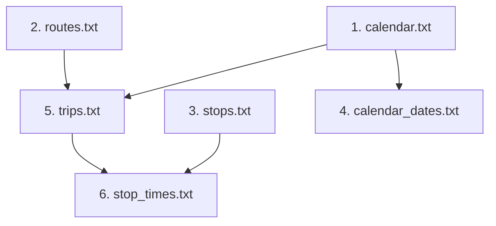

# Design: 02-gtfs-importer

## Context & Problem Statement
To enable realistic route exploration and active recall training for Queensland bus drivers, the application must ingest official GTFS schedule data from Translink Queensland. GTFS feeds are distributed as zip archives containing multiple interrelated CSV files with tens of thousands of rows. 

The ingestion pipeline must:
1. Accurately parse RFC-4180 CSV files without fragile naïve string splitting.
2. Respect foreign key constraints and database relationships.
3. Guarantee atomic transactions and idempotent re-runs.
4. Maintain clean architectural boundaries without polluting the pure TypeScript domain.

---

## Architecture & Module Structure

```text
src/
  domain/                             # Pure TypeScript domain models (unmodified)
    shared/gtfs-time.ts
    trip/trip-stop.ts
    trip/stop-sequence.ts
    service/service-calendar.ts
    route/route.ts
    route/route-variant.ts
  application/                        # Application use-case orchestration
    gtfs/
      import-gtfs-use-case.ts         # Coordinates parsing, validation, and persistence
  infrastructure/                     # Concrete I/O, parsers, and Prisma repositories
    gtfs/
      parser/
        csv-stream-parser.ts          # RFC-4180 compliant CSV stream reader
        gtfs-row-schemas.ts           # Zod-based row validators for each GTFS table
      importer/
        prisma-gtfs-repository.ts     # Batch upsert operations using Prisma Client
    prisma/
      schema.prisma                   # Persistence definitions
```

### Dependency Flow
```
[Infrastructure (CSV Parser, Prisma)] ───► [Application Use Case] ───► [Domain Models]
```
The domain layer remains completely isolated from file systems, CSV details, and database drivers.

---

## 1. GTFS CSV Parsing Specification & Edge Cases

### Standards Compliance (RFC 4180)
- **Delimiters & Quotes**: Fields containing commas, line breaks, or double quotes must be enclosed in double quotes. Escaped quotes are represented as `""`.
- **Line Endings**: Both Windows CRLF (`\r\n`) and Unix LF (`\n`) must be seamlessly handled across stream chunks.
- **Encoding & BOM**: Files must be parsed as UTF-8; byte order marks (UTF-8 BOM `\uFEFF`) at the beginning of headers must be stripped automatically.
- **Empty Strings vs Nulls**: Blank string fields (`""` or missing content between delimiters) for optional GTFS columns must map to `null`, not `"null"` or empty space.
- **Header Flexibility**: Columns in GTFS files can appear in arbitrary order. Unknown or proprietary extra columns must be safely ignored. Missing mandatory columns must trigger explicit validation errors.

### Dependency Evaluation: `DEPENDENCY DECISION REQUIRED`
- **Option 1 (Zero-Dependency Built-in RFC-4180 Parser)**:
  - Implement a dedicated streaming finite-state machine (FSM) parser in `src/infrastructure/gtfs/parser/csv-stream-parser.ts` using Node.js standard stream transformers.
  - *Pros*: Zero new npm dependencies, exact fit for GTFS line structures, lightweight, complete control over error messages.
  - *Cons*: Requires thorough test coverage for streaming chunk-boundary edge cases.
- **Option 2 (External Library: `csv-parse`)**:
  - Add `csv-parse` (`^5.6.0`) to `package.json`.
  - *Pros*: Battle-tested RFC-4180 implementation, mature stream pipeline integration.
  - *Cons*: Introduces external dependency into project.
- **Action for Review**: In accordance with project policy, this decision is marked as **`DEPENDENCY DECISION REQUIRED`** for human review prior to execution of Change 02.

---

## 2. Foreign-Key Topological Ingestion Order

GTFS tables have strict referential integrity. Ingestion must proceed in topological order:



1. **Step 1: Agency & Calendars** (`GtfsCalendar`)
   - Primary Key: `serviceId`
2. **Step 2: Routes** (`GtfsRoute`)
   - Primary Key: `routeId`
3. **Step 3: Stops** (`GtfsStop`)
   - Primary Key: `stopId`
4. **Step 4: Calendar Dates** (`GtfsCalendarDate`)
   - Composite Key: `(serviceId, date)`
   - Depends on `GtfsCalendar`
5. **Step 5: Trips** (`GtfsTrip`)
   - Primary Key: `tripId`
   - Depends on `GtfsRoute` (`routeId`) and `GtfsCalendar` (`serviceId`)
6. **Step 6: Stop Times** (`GtfsStopTime`)
   - Composite Key: `(tripId, stopSequence)`
   - Depends on `GtfsTrip` (`tripId`) and `GtfsStop` (`stopId`)

---

## 3. Ingestion Idempotency & Batching Strategy

### Upsert Strategy
To ensure that importing the same or updated feed does not create duplicates or fail on primary key collisions:
- Single-entity records (`routes`, `trips`, `stops`, `calendars`) utilize `upsert` or chunked `createMany({ skipDuplicates: true })`.
- Composite entities (`stop_times`, `calendar_dates`) utilize composite unique index resolution with chunked batches (e.g. 1,000 rows per batch) to avoid query parameter exhaustion while maintaining high throughput.

### State Cleanup for Feed Versioning
If a full feed replacement is requested, the importer can execute within an atomic transaction:
1. Delete existing GTFS records in reverse topological order (`stop_times` -> `trips` -> `stops` -> `routes` -> `calendar_dates` -> `calendars`).
2. Insert new records in forward topological order.
3. Driver knowledge tables (`DriverNote`, `HazardAlert`) are left completely untouched because they reside in isolated tables.

---

## 4. Transaction Safety & Failure Isolation

- **File Validation Phase**: Prior to database mutation, headers and critical constraints are validated across all required files. If any file is missing or contains corrupt headers, the pipeline terminates before touching the database.
- **Transaction Wrapping**: Batches are grouped inside Prisma transactional client sessions (`prisma.$transaction`) so that unhandled failures roll back changes, preventing partial or corrupt states.
- **Reporting & Logging**: The importer returns an `ImportSummary` reporting total processed rows, upsert counts, skipped duplicates, and detailed errors per file.
