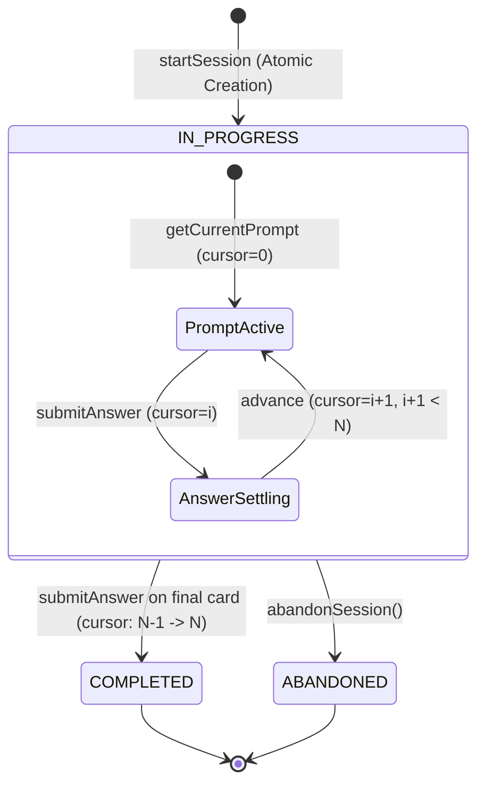

# Design: 08-recall-session-flow

## 1. Core Architectural Principles & Aggregate Boundaries

### 1.1 Separation of Workflow and SRS Memory Aggregates
- **`LearningCard` (SRS Memory Authority)**:
  - Sole authority for long-term SRS memory state: `state`, `srsLevel`, `nextReviewAt`, `repetitions`, `lapses`.
  - Mutated strictly within atomic transactions via `scheduleReview(card, outcome, now)`.
  - Completely agnostic to session lifecycle or workflow cursor position.
- **`RecallSession` (Workflow Progress Aggregate)**:
  - Sole authority for test delivery workflow: `status`, `plannedCardIds`, `currentPromptIndex`, `currentPromptStartedAt`.
  - **Does NOT store SRS data**: does not cache or duplicate levels, due dates, lapses, or interval calculations.
  - **Does NOT store prompt content**: does not store stop names, expected answers, or topology options. Prompts are resolved dynamically on-demand from GTFS topology for `plannedCardIds[currentPromptIndex]`.

### 1.2 Dynamic Prompt Resolution vs. Card Snapshot Invariant
- Change 08 snapshots card identity and ordering only (`plannedCardIds: readonly string[]`).
- Prompt content (stop sequences, question text, options) is dynamically constructed at prompt-time against current authoritative GTFS/topology data.
- **GTFS version pinning is explicitly deferred**: prompt reconstruction always queries current GTFS entities.

### 1.3 Snapshot Isolation vs. Concurrent SRS Mutations
- When a `RecallSession` is created from a `RecallSessionPlan`, `plannedCardIds` is permanently persisted in the session record.
- **Snapshot Isolation Guarantees**:
  - If Card A's SRS level changes concurrently (e.g. reviewed in another session or updated by background maintenance), the current session's sequence `[A, B, C, D]` remains strictly unchanged.
  - The session does not re-query due cards or re-sort prompts mid-session.
  - When Card A is answered, the settlement coordinator acquires a row-level lock (`SELECT ... FOR UPDATE`) on Card A, reads its authoritative current state, and executes `scheduleReview` against that fresh state. This guarantees zero lost updates and monotonic progression ($L_0 \to L_1 \to L_2$).

### 1.4 Single-Clock Discipline
- Each use case obtains exactly one authoritative `clock.now()` timestamp per transaction/use-case operation and strictly reuses that single value across all domain timestamps within that execution (`answeredAt`, `scheduleReview(..., authoritativeNow)`, `completedAt`, `abandonedAt`, `startedAt`, etc.).
- Re-invoking `clock.now()` multiple times within the same settlement or start operation is prohibited to prevent millisecond skews in domain audit logs and deterministic tests.

---

## 2. Session Lifecycle & State Machine



### 2.1 State Definitions & Invariants
1. **Non-Empty Domain Invariant**:
   - `plannedCardIds.length > 0` is strictly enforced. Attempting to instantiate a `RecallSession` with empty `plannedCardIds` throws `RecallSessionCannotBeEmptyError`.
2. **`IN_PROGRESS` (Active Session)**:
   - Initial state set immediately upon session creation (no transient `CREATED` state).
   - `startedAt` initialized with `authoritativeNow`.
   - **Cursor Invariant**: `0 <= currentPromptIndex < plannedCardIds.length`.
   - Answers can only be submitted in this state (unless replaying an already committed attempt).
3. **`COMPLETED` (Terminal Success)**:
   - Transitioned automatically when the final card (`currentPromptIndex === plannedCardIds.length - 1`) is answered and settled.
   - **Cursor Invariant**: `currentPromptIndex === plannedCardIds.length`.
   - `completedAt` set to `authoritativeNow`.
   - Strictly terminal: new submissions throw `SessionAlreadyCompletedError`. (Replaying previous attempts remains allowed).
4. **`ABANDONED` (Terminal Discard)**:
   - Explicitly triggered when a driver abandons an incomplete session.
   - `abandonedAt` set to `authoritativeNow`.
   - **Cursor Invariant**: frozen at the prompt index where abandonment occurred.
   - Strictly terminal: cannot be resumed or submitted to (`SessionAbandonedError`).
   - **Non-Rollback Semantics**: All card reviews settled prior to abandonment remain fully committed in `LearningCard`.
   - Frees the `(driverId, targetVariantKey)` active session slot so the driver can start a fresh session immediately.

---

## 3. Prompt Delivery & Transactional Timer Initialization

### 3.1 Prompt Retrieval (`GetCurrentSessionPromptUseCase`)
- Input: `sessionId: string, driverId: string`.
- **Transactional Row Lock & Timer Invariant**:
  - `GetCurrentSessionPromptUseCase` executes within a transaction that locks the session row:
    `SELECT * FROM "recall_session" WHERE "id" = $1 AND "driverId" = $2 FOR UPDATE`.
  - Validation:
    - Session must exist and belong to `driverId`.
    - Session status must be `IN_PROGRESS`.
  - **Timer Initialization Invariant**:
    - If `session.currentPromptStartedAt === null`: initialize with `authoritativeNow` and execute `UPDATE "recall_session" SET "currentPromptStartedAt" = $now WHERE "id" = $sessionId`.
    - If `session.currentPromptStartedAt !== null`: **keep unchanged**.
    - Under the row lock, concurrent GET calls are serialized; the first call sets the timestamp, and subsequent calls see the non-null timestamp and perform no update.
- **Dynamic Prompt Resolution**:
  - Resolve target card: `targetCardId = session.plannedCardIds[session.currentPromptIndex]`.
  - Fetch `LearningCard` semantic metadata and GTFS topology to assemble `RecallPrompt`.
  - Return prompt payload along with `currentPromptIndex` and `totalCards = session.plannedCardIds.length`.

### 3.2 Monotonic Cursor Progression
- Cursors are strictly 0-indexed: `0 <= currentPromptIndex < plannedCardIds.length`.
- Skipping questions is prohibited: submission `command.promptIndex` must exactly match `session.currentPromptIndex`.
  - If `command.promptIndex !== session.currentPromptIndex`, throws `InvalidPromptIndexError`.

---

## 4. Standardized Deadlock-Free Settlement Sequence & Attempt Precedence

### 4.1 Attempt Precedence Rule
> **Existing `RecallAttempt` takes precedence over session lifecycle validation for replay/conflict detection.**

If a submission retry arrives after the session has transitioned to `COMPLETED` (e.g. retry on the final question) or `ABANDONED`, the system MUST look up the `RecallAttempt` before checking `status === IN_PROGRESS`.
- **Existing Attempt**: Represents a previously settled question. Replay/conflict detection takes precedence over session lifecycle checks (`COMPLETED` or `ABANDONED`).
- **Non-Existing Attempt**: Represents a new submission. Only in this branch does the coordinator validate `status === IN_PROGRESS` and `currentPromptIndex === promptIndex`.

`RecallAttempt` lookup is performed using the unique `(sessionId, promptIndex)` constraint before any `LearningCard` lock is acquired. Duplicate submissions never lock or mutate `LearningCard`.

### 4.2 Settlement Control Flow & Locking Specification

#### NEW SUBMISSION:
```text
RecallSession FOR UPDATE
        ↓
Validate ownership (session.driverId === command.driverId)
        ↓
RecallAttempt lookup (sessionId, promptIndex)
        ↓ (Not Found)
Validate session.status === IN_PROGRESS
Validate session.currentPromptIndex === promptIndex
        ↓
LearningCard FOR UPDATE
        ↓
evaluate answer (PASS | FAIL)
        ↓
scheduleReview(card, outcome, authoritativeNow)
        ↓
RecallAttempt INSERT (persisting rawInput, recallMode, resulting 5 SRS fields)
        ↓
LearningCard UPDATE (state, srsLevel, nextReviewAt, repetitions, lapses)
        ↓
RecallSession UPDATE (currentPromptIndex, status, completedAt, currentPromptStartedAt = null)
        ↓
COMMIT TRANSACTION
```

#### DUPLICATE SUBMISSION:
```text
RecallSession FOR UPDATE
        ↓
Validate ownership (session.driverId === command.driverId)
        ↓
RecallAttempt lookup (sessionId, promptIndex)
        ↓ (Found)
Compare rawInput + recallMode
   ├─ Identical:
   │     REPLAY persisted snapshot directly from RecallAttempt
   │     COMMIT TRANSACTION
   │     (Zero LearningCard locks acquired, zero SRS re-execution)
   └─ Divergent:
         ROLLBACK TRANSACTION
         THROW IdempotencyConflictError
```

---

## 5. Authoritative Idempotency Replay Contract

### 5.1 Submission Identity Specification
The identity of a submission is strictly defined as:
```typescript
interface SubmissionIdentity {
  readonly rawInput: string;
  readonly recallMode: RecallMode;
}
```
- **Strict Verbatim Matching**: Comparison uses exact persisted string equality (`a.rawInput === b.rawInput`) and enum equality (`a.recallMode === b.recallMode`).
- **No Inferred Equivalence**: The idempotency layer performs NO whitespace trimming, lowercase folding, or semantic normalization.
  - E.g., submitting `"Stop 1"` and then `"stop 1"` are treated as **different** submissions.

### 5.2 Resulting Snapshot Storage on `RecallAttempt`
To ensure duplicate submissions can replay the exact historical outcome without re-executing SRS or reverse-engineering from the current `LearningCard`:
- `RecallAttempt` explicitly stores the resulting state snapshot produced at the moment of settlement:
  - `resultingState: CardState`
  - `resultingSrsLevel: number`
  - `resultingNextReviewAt: Date | null`
  - `resultingRepetitions: number`
  - `resultingLapses: number`

### 5.3 Replay Evaluation Rules
When an attempt is queried for `(sessionId, promptIndex)`:
1. **Duplicate Replay (Identical Submission Identity)**:
   - `attempt.rawInput === command.rawInput && attempt.recallMode === command.recallMode`.
   - Coordinator does NOT re-execute `scheduleReview`, does NOT acquire `LearningCard` locks, and does NOT advance the cursor.
   - It directly constructs the response from `RecallAttempt`'s persisted snapshot (`outcome`, `resultingState`, `resultingSrsLevel`, `resultingNextReviewAt`, etc.) and the current session status.
2. **Conflicting Replay (Divergent Submission Identity)**:
   - `attempt.rawInput !== command.rawInput || attempt.recallMode !== command.recallMode`.
   - Throws `IdempotencyConflictError("Prompt ${promptIndex} in session ${sessionId} was already submitted with different input")`.
   - Protects against retroactive mutation or conflicting double-submissions.

---

## 6. Race-Safe Session Start & Transaction Context

### 6.1 Progress Pre-Condition & Serialization Lock
- `StartPlannedRecallSessionUseCase` strictly requires an existing `DriverVariantProgress`.
  - If `driverVariantProgress` does not exist: throws `DriverNotEnrolledError`.
  - **No progress records or sessions are created implicitly.**
- Execution inside a transaction:
```typescript
await prisma.$transaction(async (tx) => {
  // 1. Serialize start requests by locking parent progress record
  const progress = await tx.$queryRaw<{ id: string }[]>`
    SELECT id FROM "driver_variant_progress"
    WHERE "driver_id" = ${driverId} AND "target_variant_key" = ${variantKey}
    FOR UPDATE
  `;
  if (!progress || progress.length === 0) {
    throw new DriverNotEnrolledError(driverId, variantKey);
  }

  // 2. Check for active session under row lock
  const activeSession = await tx.recallSession.findFirst({
    where: {
      driverId,
      targetVariantKey: variantKey,
      status: SessionStatus.IN_PROGRESS,
    },
  });

  if (activeSession) {
    return { session: toDto(activeSession), isNew: false };
  }

  // 3. Planning executed within transaction context to avoid stale reads
  const planResult = await this.planUseCase.executeWithTx(tx, {
    sessionId: randomUUID(),
    driverId,
    variantKey,
  });

  if (!planResult.plan) {
    return { session: null, isNew: false, reason: 'NO_ELIGIBLE_CARDS' };
  }

  // 4. Persist new IN_PROGRESS session
  const newSession = await tx.recallSession.create({
    data: {
      id: planResult.plan.sessionId,
      driverId,
      targetVariantKey: variantKey,
      routeId: command.routeId,
      status: SessionStatus.IN_PROGRESS,
      plannedCardIds: [...planResult.plan.cardIds],
      currentPromptIndex: 0,
      startedAt: authoritativeNow,
    },
  });

  return { session: toDto(newSession), isNew: true };
});
```

### 6.2 Interrupted Session Recovery
- If a driver closes the app mid-session and reopens it, `StartPlannedRecallSessionUseCase` returns the existing session with `isNew: false`.
- The driver calls `GetCurrentSessionPromptUseCase` and immediately resumes at `currentPromptIndex`, with all past answers preserved.

### 6.3 Session Abandonment Lifecycle & Concurrency Invariants (`AbandonRecallSessionUseCase`)
- **Lifecycle & Serialization Discipline**:
  - `AbandonRecallSessionUseCase` executes within a transaction that locks the session row first:
    `SELECT * FROM recall_session WHERE id = $sessionId FOR UPDATE`.
  - The Use Case validates ownership (`session.driverId === command.driverId`) and lifecycle under this lock before any mutation.
- **Idempotency & Timestamp Immutability**:
  - If `session.status === ABANDONED`: the operation is strictly idempotent.
  - The Use Case **does not re-write `abandonedAt`**; it returns the original `abandonedAt` and existing frozen state.
- **Terminal Status Invariants (`CannotAbandonCompletedSessionError`)**:
  - If `session.status === COMPLETED`: throws dedicated `CannotAbandonCompletedSessionError`.
  - Abandonment cannot revoke or overwrite an already completed session.
- **Cursor Freezing Invariant**:
  - `ABANDONED !== COMPLETED`.
  - When abandoned at prompt index $K$, `currentPromptIndex` remains frozen at $K$ (never set to $N$).
  - `currentPromptStartedAt` is reset to `null`.
- **In-flight Prompt Protection & Zero Mutation**:
  - The card at `currentPromptIndex` that was not yet submitted has NO `RecallAttempt` created and its `LearningCard` SRS state remains completely untouched.
- **Non-Rollback of Past Settled Attempts**:
  - Attempts $0 \dots K-1$ and their committed `LearningCard` SRS state transitions remain permanent in PostgreSQL.
- **Variant Freeing & Fresh Session Creation**:
  - Abandoning frees the variant slot (`WHERE status = 'IN_PROGRESS'` returns null).
  - Subsequent `StartPlannedRecallSessionUseCase` creates a brand new session (`newSession.id !== oldSession.id`) with a freshly planned `plannedCardIds` snapshot.
- **Deterministic Concurrency Serialization (Submit vs Abandon)**:
  - Both operations serialize on `RecallSession FOR UPDATE`.
  - **Scenario A (Abandon wins lock)**: Session status becomes `ABANDONED`. Subsequent Submit for a new answer fails with `SessionNotActiveError`. (Existing duplicate attempts replay safely via Attempt Precedence).
  - **Scenario B (Final Submit wins lock)**: Submit transitions session to `COMPLETED`. Subsequent Abandon fails with `CannotAbandonCompletedSessionError`. If non-final Submit wins lock, cursor advances to $K+1$, and subsequent Abandon marks the session `ABANDONED` with cursor frozen at $K+1$.

---

## 7. Persistence Schema Specification

### 7.1 Prisma Schema Delta
Update `model RecallSession` and `model RecallAttempt` in `prisma/schema.prisma`:

```prisma
enum SessionStatus {
  IN_PROGRESS
  COMPLETED
  ABANDONED
}

model RecallSession {
  id                     String          @id @default(uuid())
  driverId               String
  routeId                String
  targetVariantKey       String
  status                 SessionStatus   @default(IN_PROGRESS)
  plannedCardIds         String[]        @default([]) @map("planned_card_ids")
  currentPromptIndex     Int             @default(0)
  currentPromptStartedAt DateTime?
  startedAt              DateTime        @default(now())
  completedAt            DateTime?
  abandonedAt            DateTime?
  attempts               RecallAttempt[]

  @@index([driverId, status])
  @@index([driverId, targetVariantKey])
  @@map("recall_session")
}

model RecallAttempt {
  id                    String        @id @default(uuid())
  sessionId             String
  promptIndex           Int
  cardKey               String        // Historical semantic snapshot, not a foreign key
  recallMode            RecallMode
  rawInput              String
  expectedAnswer        String
  outcome               RecallOutcome
  startedAt             DateTime
  answeredAt            DateTime      @default(now())
  durationMs            Int
  
  // Historical resulting SRS snapshot for authoritative idempotent replay
  resultingState        CardState     @map("resulting_state")
  resultingSrsLevel     Int           @default(0) @map("resulting_srs_level")
  resultingNextReviewAt DateTime?     @map("resulting_next_review_at")
  resultingRepetitions  Int           @default(0) @map("resulting_repetitions")
  resultingLapses       Int           @default(0) @map("resulting_lapses")

  session               RecallSession @relation(fields: [sessionId], references: [id], onDelete: Cascade)

  @@unique([sessionId, promptIndex])
  @@index([sessionId])
  @@index([cardKey])
  @@map("recall_attempt")
}
```
