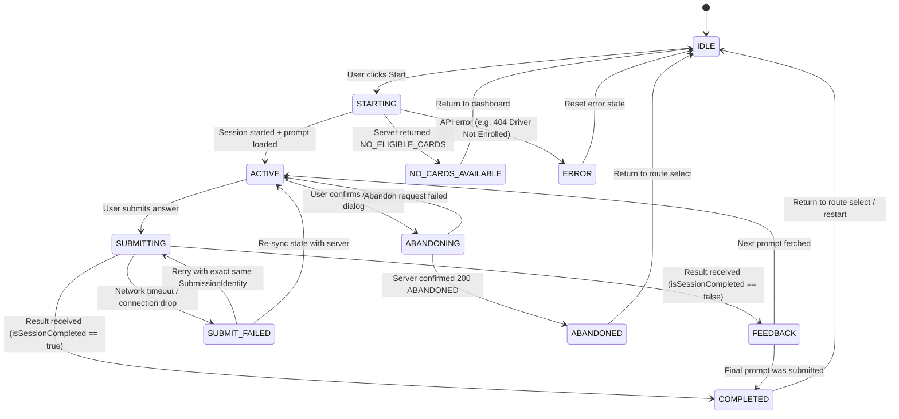

# Design: Change 10 — Recall Session Client & UI Integration

## 1. Architectural Principles & Layered Boundaries

```text
Browser / Mobile Client (Bus Driver)
        │
        ▼
Next.js App Router (`/practice/recall`)
  ├─ Page Layout & Error Boundary (`page.tsx`)
  └─ UI Components (`src/components/ui/...`)
        │
        ▼ (Action / State Events)
Client View State Machine (`useRecallSession` Hook)
  ├─ State (11 View States): IDLE | STARTING | NO_CARDS_AVAILABLE | ACTIVE | SUBMITTING | SUBMIT_FAILED | FEEDBACK | COMPLETED | ABANDONING | ABANDONED | ERROR
  ├─ Controlled Submission Identity Lock (`SubmissionIdentity`)
  └─ Idempotency Safety Guards
        │
        ▼ (Type-Safe RPC-like invocation)
Recall API Client (`src/application/recall/client/`)
  ├─ `RecallApiClient` (`recall-api.ts`)
  ├─ Strong DTOs (`recall-types.ts`)
  └─ Typed Errors (`recall-errors.ts`)
        │
        ▼ HTTP JSON (`/api/recall/sessions/...`)
Change 09 Next.js Route Handlers (Server-Side)
  └─ Application Use Cases -> PostgreSQL Transaction Isolation (`FOR UPDATE`)
```

### 1.1 Strict Invariants & Non-Negotiables
1. **Change 07/08/09 Immutability**:
   - Change 10 is an API consumer and UI orchestrator ONLY.
   - Zero modifications to Change 07 SRS scheduling, Change 08 domain models, or Change 09 API route handlers.
   - Zero modifications to PostgreSQL schema or Prisma models.
2. **P0 Identity Isolation**:
   - The frontend never provides, overrides, or requests `driverId`.
   - Identity is resolved authoritatively on the server.
3. **Controlled Submission Identity (Anti-Idempotency-Hazard)**:
   - The UI never auto-retries failed `POST /answer` calls with arbitrary or altered payloads.
   - Retrying a submission strictly re-uses the exact `SubmissionIdentity` (`sessionId`, `promptIndex`, `rawInput`, `recallMode`) to guarantee safe idempotent execution and avoid HTTP 409 `IDEMPOTENCY_CONFLICT`.
4. **Clean Presentation Boundary**:
   - View State governs rendering and animations only; it does not duplicate or anticipate backend state machine calculations.

---

## 2. API Client Contract & DTO Binding

The API Client layer under `src/application/recall/client/` wraps all 5 Change 09 REST endpoints:

### 2.1 Endpoint Binding Matrix

| Endpoint | Method | Client Method | Request Payload | Success Payload (`data`) | Key Error Codes |
|---|---|---|---|---|---|
| `/api/recall/sessions` | POST | `startPlannedSession(dto)` | `{ routeId, variantKey, sessionSize?, dueRatio? }` | `{ session: RecallSessionDto \| null, isNew: boolean, reason? }` | 400 `INVALID_REQUEST`, 401 `UNAUTHENTICATED`, 404 `DRIVER_NOT_ENROLLED` |
| `/api/recall/sessions/[id]/prompt` | GET | `getCurrentPrompt(sessionId)` | None | `{ prompt: CurrentSessionPromptDto }` | 401 `UNAUTHENTICATED`, 403 `SESSION_FORBIDDEN`, 404 `SESSION_NOT_FOUND`, 409 `SESSION_NOT_ACTIVE` |
| `/api/recall/sessions/[id]/answer` | POST | `submitAnswer(sessionId, submission)` | `{ promptIndex, rawInput, recallMode? }` | `{ outcome: 'PASS' \| 'FAIL', promptIndex, isSessionCompleted, resultingState, resultingSrsLevel, isDuplicate }` | 400 `PROMPT_INDEX_MISMATCH`, 401 `UNAUTHENTICATED`, 403 `SESSION_FORBIDDEN`, 409 `IDEMPOTENCY_CONFLICT`, 409 `SESSION_NOT_ACTIVE` |
| `/api/recall/sessions/[id]/abandon` | POST | `abandonSession(sessionId)` | `{}` | `{ sessionId, status: 'ABANDONED', abandonedAt, currentPromptIndex, totalCards }` | 401 `UNAUTHENTICATED`, 403 `SESSION_FORBIDDEN`, 404 `SESSION_NOT_FOUND`, 409 `CANNOT_ABANDON_COMPLETED_SESSION` |
| `/api/recall/sessions/[id]` | GET | `getSessionState(sessionId)` | None | `{ session: SessionStateDto }` | 401 `UNAUTHENTICATED`, 403 `SESSION_FORBIDDEN`, 404 `SESSION_NOT_FOUND` |

### 2.2 Domain Enum Alignment
- **RecallMode**: `'NEXT_STOP_FORWARD' | 'STOP_NAME_RECOGNITION'`
- **RecallOutcome**: `'PASS' | 'FAIL'`
- **SessionStatus**: `'IN_PROGRESS' | 'COMPLETED' | 'ABANDONED'`
- **CardState**: `'NEW' | 'LEARNING' | 'REVIEW' | 'MASTERED'`

### 2.3 Client Error Taxonomy
HTTP status codes and error JSON payloads are parsed into strongly-typed error classes inheriting from `RecallClientError`:
- `UnauthenticatedError` (401)
- `SessionForbiddenError` (403)
- `SessionNotFoundError` (404)
- `DriverNotEnrolledError` (404)
- `PromptIndexMismatchError` (400)
- `IdempotencyConflictError` (409)
- `SessionNotActiveError` (409)
- `CannotAbandonCompletedSessionError` (409)
- `NetworkError` (Network failure / fetch timeout)
- `ServerError` (500)

---

## 3. View State Machine



### 3.1 Interaction Ergonomics
1. **Input Lockout**: The text input is immediately disabled upon submit click / Enter press to eliminate double submissions.
2. **Keyboard Navigation**:
   - `Enter` in `ACTIVE` state: Submit answer.
   - `Enter` or `Space` in `FEEDBACK` state: Advance to next prompt.
   - `Esc`: Close open dialogs.
3. **Manual Retry UX**: In `SUBMIT_FAILED` state, the UI presents an explicit "Retry" button that re-submits the exact locked `SubmissionIdentity`.

---

## 4. UI Component Architecture & Design System

### 4.1 Reusable UI Primitives (`src/components/ui/`)
- `Button`: Primary, secondary, destructive, and ghost styles with interactive loading states and accessible tap targets.
- `Card`: Bordered, high-contrast surface container.
- `Badge`: Semantic badges for RecallMode (`Next Stop`, `Station Name`) and Outcome (`Correct`, `Incorrect`, `Duplicate`).
- `ProgressBar`: High-visibility progress gauge with `aria-valuenow`.
- `Modal`: Accessible modal dialog with backdrop, ESC dismissal, and focus trapping.
- `TextInput`: Keyboard-accessible text input with label, helper text, and clear error borders.

### 4.2 Accessibility & Mobile Design
- **Mobile Touch**: Touch targets >= 44x44px. Layout tested down to 360px screen width.
- **Contrast**: Complies with WCAG 2.1 AA (>= 4.5:1 text contrast).
- **ARIA**: Live regions for feedback announcements (`aria-live="polite"`).
