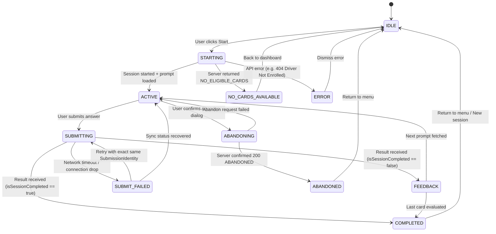

# Specification: View State Machine & Practice Flow (Change 10)

## 1. Separation of Concerns

```text
┌────────────────────────────────────────────────────────┐
│  Authoritative Backend Domain State                    │
│  - Controlled by Change 08 Use Cases in PostgreSQL     │
│  - Values: `IN_PROGRESS` | `COMPLETED` | `ABANDONED`   │
└──────────────────────────┬─────────────────────────────┘
                           │ Evaluated via HTTP Responses
┌──────────────────────────▼─────────────────────────────┐
│  Transient Frontend View State                         │
│  - Governs UI components, spinners, input fields       │
│  - Never mutates domain state directly                 │
└────────────────────────────────────────────────────────┘
```

---

## 2. View State Definitions

The Recall Practice UI (`/practice/recall`) is driven by an explicit 11-State View State Machine:

| View State | Description | Allowed Transitions |
|---|---|---|
| `IDLE` | Practice screen loaded, waiting for driver to select route/variant or click "Start Session". | `STARTING` |
| `STARTING` | Requesting `POST /api/recall/sessions`. Showing loading skeleton/spinner. | `ACTIVE`, `NO_CARDS_AVAILABLE`, `ERROR` |
| `NO_CARDS_AVAILABLE` | Server returned `reason: 'NO_ELIGIBLE_CARDS'`. Drivers are prompted that no cards are currently due. | `IDLE` |
| `ACTIVE` | Active prompt displayed. Driver can read reference, type answer, or click abandon. | `SUBMITTING`, `ABANDONING` |
| `SUBMITTING` | Submitting answer to `POST /answer`. Input is locked and submit button displays a spinner. | `FEEDBACK`, `COMPLETED`, `SUBMIT_FAILED` |
| `SUBMIT_FAILED` | Network failure during submission. Controlled `SubmissionIdentity` preserved for safe retry. | `SUBMITTING`, `ACTIVE`, `ERROR` |
| `FEEDBACK` | Answer feedback displayed (Correct/Incorrect badge, SRS progression). User clicks "Next" or presses Enter to proceed. | `ACTIVE`, `COMPLETED` |
| `COMPLETED` | Session finished (`isSessionCompleted: true` or status `COMPLETED`). Summary displayed. | `IDLE` |
| `ABANDONING` | User confirmed abandon modal; sending `POST /abandon`. | `ABANDONED`, `ACTIVE` (on error) |
| `ABANDONED` | Session successfully abandoned. Confirmation banner shown. | `IDLE` |
| `ERROR` | Unrecoverable error occurred (e.g., 401, 403, 500). Error card with details and reset button. | `IDLE` |

---

## 3. State Transition Diagram



---

## 4. Interaction & UX Rules

1. **Submission Lockout**:
   - As soon as the driver hits "Submit" or presses Enter, the input field is disabled and marked read-only to prevent double clicks and duplicate submissions.
2. **Keyboard Ergonomics**:
   - Enter key in `ACTIVE` state triggers submission.
   - Enter key or Space in `FEEDBACK` state advances to the next prompt.
   - Escape key cancels active modals.
3. **Controlled Feedback Transition**:
   - `FEEDBACK` view explicitly presents whether the answer was `CORRECT` or `INCORRECT`.
   - Displays SRS feedback: resulting card state (`LEARNING`, `REVIEW`, `MASTERED`) and level (`Level 1`, `Level 2`, etc.).
   - The user has complete control over when to advance to the next question (no auto-advancing that cuts off learning feedback).
4. **Abandonment Safeguards**:
   - Abandoning a session requires an explicit confirmation modal to prevent accidental loss of active practice sessions.
